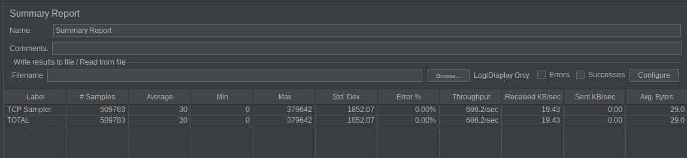

# Multithreaded_Server
TCP/HTTP implementations using java sockets.

## Implementation of Single Threaded, Multi Threaded and Threadpool servers.
Testing was completed by sending TCP requests over 10000 requests per second without having any siignificant error and failure.

