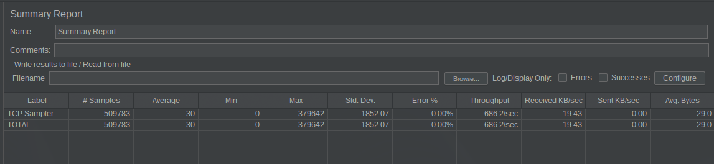

# 🖥️ Java TCP/HTTP Server Implementations

A Java-based project demonstrating three server architectures — **Single-Threaded**, **Multi-Threaded**, and **Thread Pool** — built using raw Java sockets. Designed to explore concurrency patterns and understand the trade-offs between each approach under load.

---

## 📁 Project Structure

```
src/main/java/com/sgr9/
├── singleThreaded/
│   ├── Server.java       # Handles one client at a time
│   └── client.java       # Single-threaded test client
├── multiThreaded/
│   ├── Server.java       # Spawns a new thread per connection
│   └── client.java       # Concurrent test client (100 threads)
└── threadPool/
    ├── Server.java       # Fixed-size thread pool (default: 10)
    └── client.java       # Concurrent test client (100 threads)
```

---

## ⚙️ Server Implementations

### 1. Single-Threaded Server
Processes one client connection at a time. Simple and easy to reason about, but blocks on each request — subsequent clients must wait until the current connection is finished.

- **Package:** `com.sgr9.singleThreaded`
- **Port:** `8010`
- **Best for:** Learning, debugging, or very low-traffic use cases

### 2. Multi-Threaded Server
Spawns a **new thread** for every incoming client connection, allowing concurrent request handling. Responsive under moderate load, but thread creation overhead and unbounded thread growth can be a concern at scale.

- **Package:** `com.sgr9.multiThreaded`
- **Port:** `8010`
- **Best for:** Moderate concurrency with short-lived connections

### 3. Thread Pool Server
Uses a **fixed-size `ExecutorService`** thread pool to reuse threads across connections. Balances concurrency and resource control — excess connections queue until a thread becomes available.

- **Package:** `com.sgr9.threadPool`
- **Port:** `8010`
- **Pool Size:** `10` (configurable via `poolSize` variable)
- **Best for:** Production-like scenarios requiring controlled resource usage

---

## 🚀 Getting Started

### Prerequisites
- Java 8+
- Maven

### Build

```bash
mvn clean install
```

### Run a Server

**Single-Threaded:**
```bash
mvn exec:java -Dexec.mainClass="com.sgr9.singleThreaded.httpServer"
```

**Multi-Threaded:**
```bash
mvn exec:java -Dexec.mainClass="com.sgr9.multiThreaded.httpServer"
```

**Thread Pool:**
```bash
mvn exec:java -Dexec.mainClass="com.sgr9.threadPool.httpServer"
```

### Run the Test Client

Each package includes a `client.java` that spawns **100 concurrent threads**, each opening a socket connection to `localhost:8010`.

```bash
mvn exec:java -Dexec.mainClass="com.sgr9.multiThreaded.client"
```

---

## 🧪 Performance Testing

Load testing was conducted by sending **10,000+ TCP requests per second** with no significant errors or failures across all three implementations.

| Server Type    | Concurrency Model        | Thread Safety | Scalability  |
|----------------|--------------------------|---------------|--------------|
| Single-Threaded | Sequential               | ✅ Trivially   | ❌ Low        |
| Multi-Threaded  | Thread-per-connection    | ✅ Yes         | ⚠️ Medium    |
| Thread Pool     | Fixed `ExecutorService`  | ✅ Yes         | ✅ High       |

> **Note:** Thread Pool size can be tuned by modifying `poolSize` in `threadPool/Server.java`.

---

## 📸 Screenshot



---

## 🔧 Configuration

| Parameter     | Default | Location                        |
|---------------|---------|---------------------------------|
| Port          | `8010`  | All `Server.java` files         |
| Socket Timeout | `70000–100000 ms` | All `Server.java` files |
| Thread Pool Size | `10` | `threadPool/Server.java`        |

---

## 📄 License

This project is licensed under the [MIT License](./LICENSE).
